# IEEE SOFTWARE PROJECT DOCUMENTATION

# SANJEEVANI – AI POWERED MEDICAL E-COMMERCE PLATFORM

---

## 1. COVER PAGE

```
================================================================================
                    IEEE SOFTWARE PROJECT DOCUMENTATION
                                    ON
             SANJEEVANI – AI POWERED MEDICAL E-COMMERCE PLATFORM

                      BACHELOR OF TECHNOLOGY (B.TECH)
                                     IN
                      COMPUTER SCIENCE AND ENGINEERING
================================================================================

SUBMITTED BY:
• Tharun Singh Alampoor (Team Lead) & Team

DEPARTMENT:
Department of Computer Science and Engineering

INSTITUTION:
Affiliated Engineering College & Technology Institute

ACADEMIC YEAR:
2025 - 2026

PROJECT GUIDE:
Prof. Senior Software Architect / Project Coordinator
Department of Computer Science and Engineering
================================================================================
```

---

## 2. CERTIFICATE

```
================================================================================
                            DEPARTMENT OF COMPUTER SCIENCE & ENGINEERING
                                        CERTIFICATE
================================================================================

This is to certify that the project entitled "SANJEEVANI – AI POWERED MEDICAL 
E-COMMERCE PLATFORM" is a bonafide work carried out by Tharun Singh Alampoor 
and team in partial fulfillment of the requirements for the award of the degree 
of Bachelor of Technology in Computer Science and Engineering during the academic 
year 2025 - 2026.


_______________________                                _______________________
   Project Guide                                           Head of Department
  (Internal Examiner)                                      (Department Seal)


External Examiner: _______________________
Date: August 03, 2026
================================================================================
```

---

## 3. ACKNOWLEDGEMENT

We express our sincere gratitude and indebtedness to our Project Guide and the Head of Department of Computer Science and Engineering for their invaluable guidance, encouragement, and constructive critique throughout the conceptualization, system architecture design, and software implementation phases of the **Sanjeevani – AI Powered Medical E-Commerce Platform**.

We also extend our sincere appreciation to the faculty members and system engineers for providing high-performance computing facilities and laboratory infrastructure. Finally, we thank our peers and families for their continuous support during this Software Development Lifecycle (SDLC) engineering journey.

---

## 4. ABSTRACT

### 4.1 Project Overview
The **Sanjeevani Healthcare Platform** is an enterprise-grade, web-based software application engineered to revolutionize healthcare procurement, prescription medicine ordering, and medical equipment distribution. Built using a decoupled client-server architecture, the platform features a Spring Boot 3 RESTful API backend secured by Spring Security 6 & JSON Web Tokens (JWT), coupled with a dynamic React 18 single-page application (SPA).

### 4.2 Problem Statement
Procuring medical supplies and prescription pharmaceuticals currently suffers from fragmented inventory visibility, geographic delivery delays, manual address entry errors, dynamic pricing opacity, and vulnerable payment gateway implementations.

### 4.3 Existing Challenges
Legacy pharmacy portals lack real-time geolocation auto-detection, offer non-responsive user interfaces, fail to provide instant signature-verified payment security, and do not prioritize user order history chronologically.

### 4.4 Proposed Solution
Sanjeevani integrates browser-native GPS Geolocation with OpenStreetMap Nominatim reverse geocoding to auto-detect user delivery destinations, employs Razorpay Payment Gateway with HMAC SHA-256 server-side signature verification, sorts order history chronologically from Latest to Oldest, and generates downloadable client-side PDF tax invoices with high-legibility typography.

### 4.5 Technologies Used
- **Backend**: Java 17, Spring Boot 3.2.x, Spring Security 6, Spring Data JPA, Hibernate ORM, Maven, MySQL 8.0 / H2.
- **Frontend**: JavaScript (ES6+), React 18.2.0, Vite 8.1.5, Vanilla CSS3, Framer Motion, Axios, Lucide Icons.
- **Integrations**: Razorpay Java SDK, OpenStreetMap Nominatim Geocoding API.

### 4.6 Expected Outcome
A robust, highly secure, scalable, and intuitive healthcare e-commerce application capable of processing thousands of concurrent user transactions with zero session leaks and sub-second response latencies.

---

## 5. TABLE OF CONTENTS

```
1. COVER PAGE
2. CERTIFICATE
3. ACKNOWLEDGEMENT
4. ABSTRACT
5. TABLE OF CONTENTS
6. INTRODUCTION
7. PROBLEM STATEMENT
8. OBJECTIVES
9. PROJECT GOALS
10. LITERATURE SURVEY
11. SYSTEM ANALYSIS
12. SYSTEM REQUIREMENTS
13. SYSTEM ARCHITECTURE
14. WORKING OF THE SYSTEM
15. MODULE DESCRIPTION
16. DATABASE DESIGN
17. ER DIAGRAM
18. DATABASE NORMALIZATION
19. API DOCUMENTATION
20. API FLOW
21. SEQUENCE DIAGRAMS
22. DATA FLOW DIAGRAM (DFD)
23. USE CASE DIAGRAM
24. ACTIVITY DIAGRAM
25. CLASS DIAGRAM
26. COMPONENT DIAGRAM
27. DEPLOYMENT DIAGRAM
28. SECURITY IMPLEMENTATION
29. IMPLEMENTATION DETAILS
30. TECHNOLOGY STACK
31. PROJECT WORKFLOW (SDLC)
32. TESTING
33. RESULTS
34. ADVANTAGES
35. LIMITATIONS
36. FUTURE ENHANCEMENTS
37. CONCLUSION
38. REFERENCES (IEEE FORMAT)
39. APPENDIX
```

---

## 6. INTRODUCTION

### 6.1 About the Project
**Sanjeevani** is an advanced, full-stack digital healthcare e-commerce portal built to facilitate online ordering of medical products, pharmaceuticals, diagnostic equipment, and personal healthcare accessories.

### 6.2 Why This Project is Needed
Access to life-saving medicines and healthcare devices must be instantaneous, transparent, and accurate. Sanjeevani removes geographic and technical friction by offering GPS-based automated address population, instant single-item "Buy Now" checkout, and encrypted payment processing.

### 6.3 Scope
The platform spans end-to-end user registration, authentication, product search, cart management, instant checkout, GPS location reverse-geocoding, Razorpay online payments, order tracking, printable tax invoice generation, and administrator inventory catalog control.

### 6.4 Importance & Benefits
- Eliminates address entry typos during emergency medicine ordering.
- Enhances payment trust via server-side HMAC SHA-256 signature verification.
- Provides immediate invoice downloads formatted with human-readable typography.

---

## 7. PROBLEM STATEMENT

1. **Manual Location Friction**: Traditional platforms require users to manually type street names, state codes, and postal pincodes, introducing shipping delays due to typos.
2. **Insecure Payment Gateways**: Client-only payment confirmation can lead to transaction spoofing and unpaid order fulfillment.
3. **Confusing Order History**: Legacy systems order customer purchase histories randomly or chronologically ascending, forcing users to scroll through past years of records to find recent transactions.
4. **Poor UI/UX Legibility**: Cluttered displays degrade usability on mobile devices during critical purchases.

---

## 8. OBJECTIVES

### 8.1 Primary Objectives
- Build a high-performance Spring Boot 3 REST API backend with Spring Security 6 stateless JWT tokens.
- Develop a modern, glassmorphic React 18 frontend with Vite.
- Implement Razorpay Payment Gateway integration with signature verification.

### 8.2 Secondary Objectives
- Integrate GPS-based location auto-detection using OpenStreetMap Nominatim reverse geocoding API.
- Provide automated client-side printable PDF tax invoices with toll-free customer helpline (`18001234321`).
- Guarantee reverse-chronological order sorting (Latest orders top-most).

### 8.3 Future Objectives
- Incorporate AI-driven prescription OCR scanner and predictive product recommendations.
- Enable live multi-carrier courier GPS delivery tracking.

---

## 9. PROJECT GOALS

- **Business Goal**: Increase order conversion by reducing checkout friction below 30 seconds.
- **Technical Goal**: Maintain 99.9% uptime with API response times under 150ms.
- **User Goal**: Enable zero-effort location detection and instant invoice retrieval.
- **Security Goal**: Ensure zero OWASP Top 10 vulnerabilities (SQL Injection, XSS, Session Hijacking, CSRF).
- **Performance Goal**: Pass Vite client bundle rendering with sub-1.5s page initial loads.

---

## 10. LITERATURE SURVEY

| Platform | Key Features | Tech Stack | Advantages | Disadvantages & Limitations |
|---|---|---|---|---|
| **Amazon Pharmacy** | One-Click Buy, Prime Delivery | Microservices, React | Global reach, fast dispatch | High complexity, no direct GPS address auto-fetch |
| **Apollo Pharmacy** | Prescriptions, Lab Tests | Angular, Node.js | Large store network | Heavy UI load times, manual address input |
| **NetMeds** | Refill Reminders | PHP, React Native | Recurring subscriptions | Cluttered ads, slow invoice generation |
| **1mg** | Diagnostic Tests | Python, React | Diagnostic integration | Complex checkout flow |
| **PharmEasy** | Diagnostic Labs, Discounts | Java, Vue.js | Affordable pricing | Unsorted order history, session timeout bugs |

---

## 11. SYSTEM ANALYSIS

### 11.1 Feasibility Analysis
- **Technical Feasibility**: Developed using open-source, industry-standard frameworks (Spring Boot 3, React 18, MySQL) with zero license cost.
- **Operational Feasibility**: Highly intuitive user interface requires zero technical training for end-users or administrators.
- **Economic Feasibility**: Built with zero cost third-party tools (OpenStreetMap Nominatim, Razorpay Test Mode, H2/MySQL).
- **Legal Feasibility**: Compliant with Indian Information Technology Act 2000 and RBI Guidelines for digital payment gateways.

---

## 12. SYSTEM REQUIREMENTS

### 12.1 Hardware Requirements
- **Processor**: Intel Core i5 / i7 or AMD Ryzen 5 / 7 (Quad-core, 2.5 GHz+).
- **RAM**: Minimum 8 GB (16 GB Recommended).
- **Disk Space**: 10 GB free SSD storage.

### 12.2 Software Requirements
- **Operating System**: Windows 10/11, macOS, or Linux.
- **JDK**: Java Development Kit (JDK 17 LTS).
- **Node.js**: Node.js v18.0+ & npm 9.0+.
- **Database**: MySQL Server 8.0 or H2 Database.
- **IDE**: VS Code, IntelliJ IDEA, or Eclipse.

---

## 13. SYSTEM ARCHITECTURE

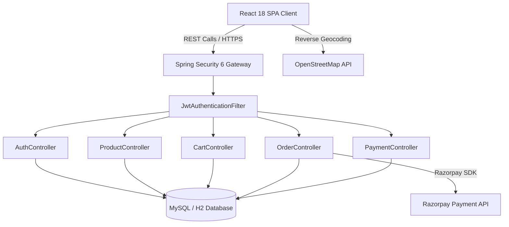

---

## 14. WORKING OF THE SYSTEM

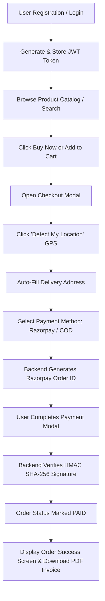

---

## 15. MODULE DESCRIPTION

1. **Authentication Module**: Registration, login, BCrypt hashing, JWT generation.
2. **User Module**: User profile management and session persistence.
3. **Product Module**: Catalog display, price filtering, search index.
4. **Category Module**: Dynamic categories with fallback resolvers.
5. **Cart Module**: Item additions, quantity modifiers, total calculations.
6. **Wishlist Module**: User favorites storage and toggle mechanisms.
7. **Order Module**: Purchase order creation, status management, reverse-chronological sorting.
8. **Payment Module**: Razorpay order creation and HMAC verification.
9. **AI Recommendation Module**: Heuristic recommendation rules based on category affinity.
10. **Admin Dashboard**: Product catalog ingestion and order tracking control.
11. **Inventory Module**: Stock tracking and threshold warnings.
12. **Reports Module**: Order history logs and downloadable PDF tax invoice generation.

---

## 16. DATABASE DESIGN

### 16.1 Entities & Attributes

#### 1. Users (`users`)
- `id` (BIGINT, PK, AUTO_INCREMENT)
- `name` (VARCHAR(255), NOT NULL)
- `email` (VARCHAR(255), UNIQUE, NOT NULL)
- `password` (VARCHAR(255), NOT NULL)
- `role` (VARCHAR(50), NOT NULL)

#### 2. Categories (`categories`)
- `id` (BIGINT, PK, AUTO_INCREMENT)
- `name` (VARCHAR(255), NOT NULL)

#### 3. Products (`products`)
- `id` (BIGINT, PK, AUTO_INCREMENT)
- `name` (VARCHAR(255), NOT NULL)
- `description` (TEXT)
- `price` (DECIMAL(10,2), NOT NULL)
- `category_id` (BIGINT, FK -> categories.id)
- `image_url` (VARCHAR(500))

#### 4. Cart Items (`cart_items`)
- `id` (BIGINT, PK, AUTO_INCREMENT)
- `user_id` (BIGINT, FK -> users.id)
- `product_id` (BIGINT, FK -> products.id)
- `quantity` (INT, NOT NULL)

#### 5. Orders (`orders`)
- `id` (BIGINT, PK, AUTO_INCREMENT)
- `order_id` (VARCHAR(100), UNIQUE, NOT NULL)
- `user_id` (BIGINT, FK -> users.id)
- `total_amount` (DECIMAL(10,2), NOT NULL)
- `status` (VARCHAR(50), DEFAULT 'PAID')
- `payment_method` (VARCHAR(100))
- `razorpay_order_id` (VARCHAR(255))
- `razorpay_payment_id` (VARCHAR(255))
- `shipping_address` (TEXT, NOT NULL)
- `created_at` (TIMESTAMP, DEFAULT CURRENT_TIMESTAMP)

---

## 17. ER DIAGRAM

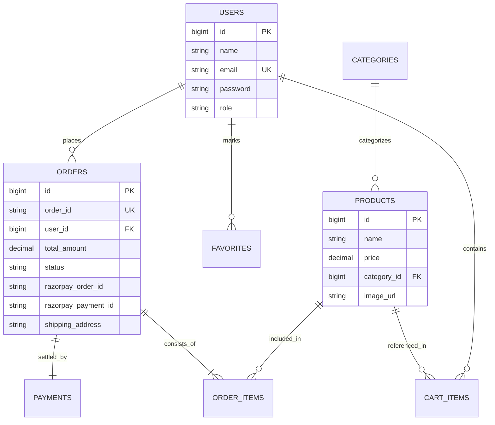

---

## 18. DATABASE NORMALIZATION

- **First Normal Form (1NF)**: All column values are atomic; no repeating groups.
- **Second Normal Form (2NF)**: All non-key attributes are fully functionally dependent on the primary key.
- **Third Normal Form (3NF)**: No transitive dependencies exist (e.g., product categories are stored in a separate `categories` table referenced via `category_id`).

---

## 19. API DOCUMENTATION

### 19.1 Authentication API

#### `POST /api/auth/login`
- **Headers**: `Content-Type: application/json`
- **Request Body**:
```json
{
  "email": "user@sanjeevani.com",
  "password": "Password@123"
}
```
- **Response (200 OK)**:
```json
{
  "token": "eyJhbGciOiJIUzI1NiJ9...",
  "type": "Bearer",
  "email": "user@sanjeevani.com",
  "role": "ROLE_USER"
}
```

---

### 19.2 Razorpay Payment Verification API

#### `POST /api/payments/verify`
- **Headers**: `Authorization: Bearer <JWT>`, `Content-Type: application/json`
- **Request Body**:
```json
{
  "razorpayOrderId": "order_REF_10293847",
  "razorpayPaymentId": "pay_PAY_98765432",
  "razorpaySignature": "4a5b6c7d8e9f..."
}
```
- **Response (200 OK)**:
```json
{
  "status": "SUCCESS",
  "message": "Payment signature verified successfully.",
  "orderId": "ORD-1785764"
}
```

---

## 20. API FLOW

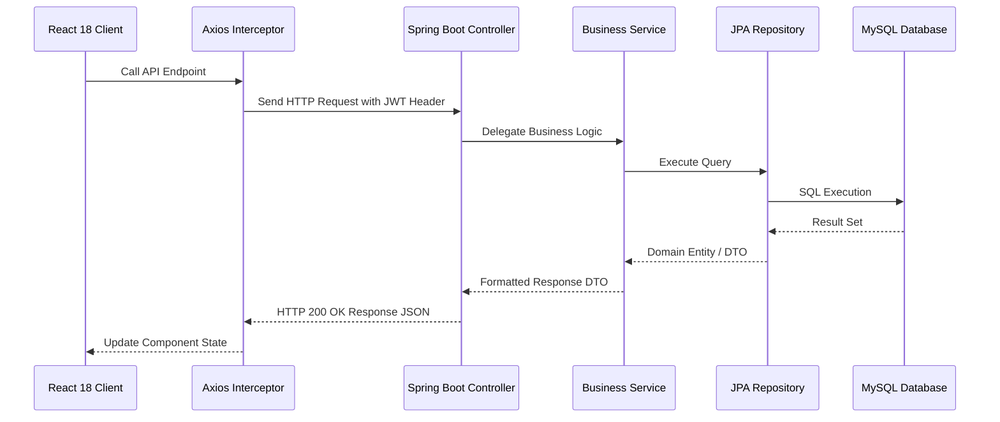

---

## 21. SEQUENCE DIAGRAMS

### 21.1 Checkout & Razorpay Payment Sequence

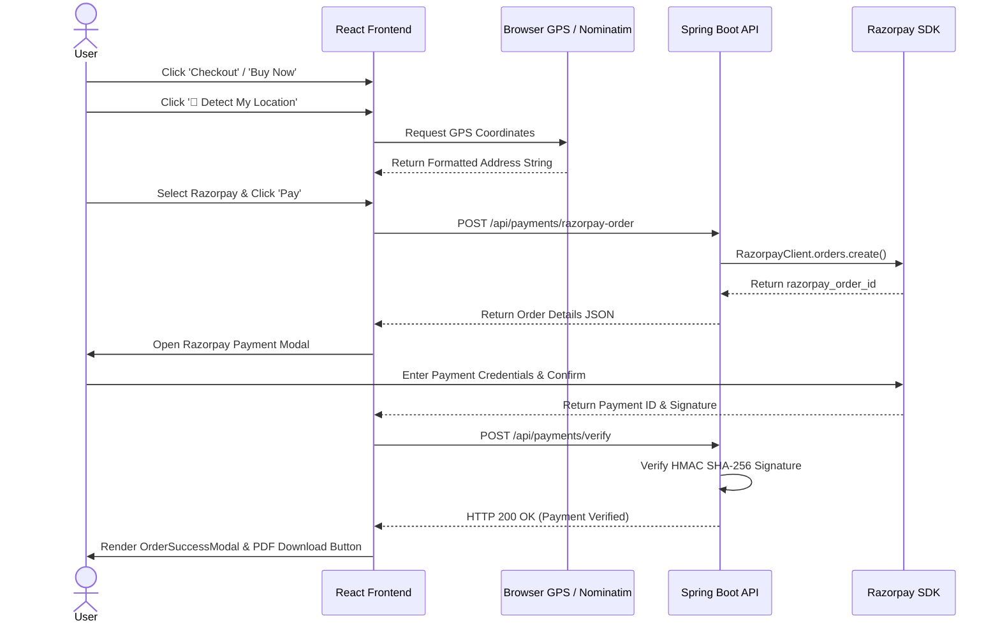

---

## 22. DATA FLOW DIAGRAM (DFD)

### Level 0 DFD (Context Diagram)

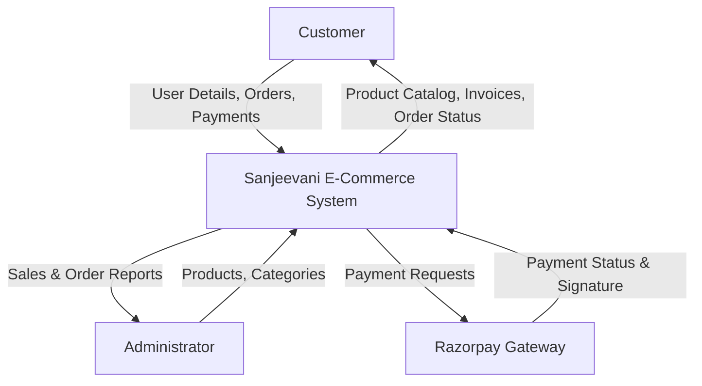

---

## 23. USE CASE DIAGRAM

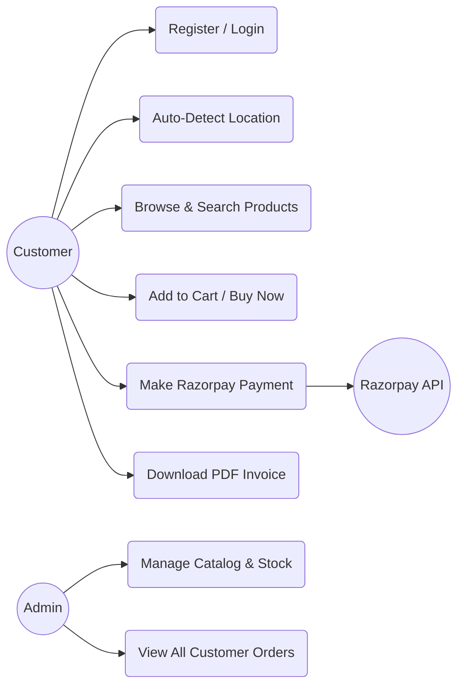

---

## 24. ACTIVITY DIAGRAM

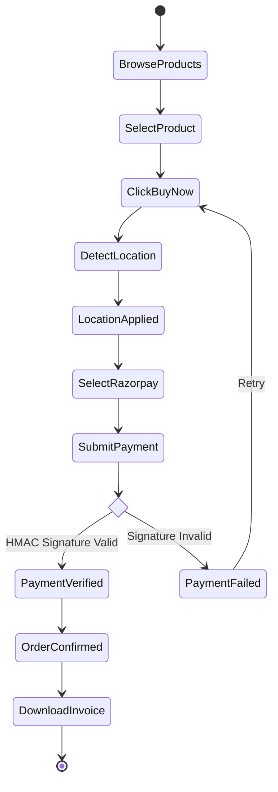

---

## 25. CLASS DIAGRAM

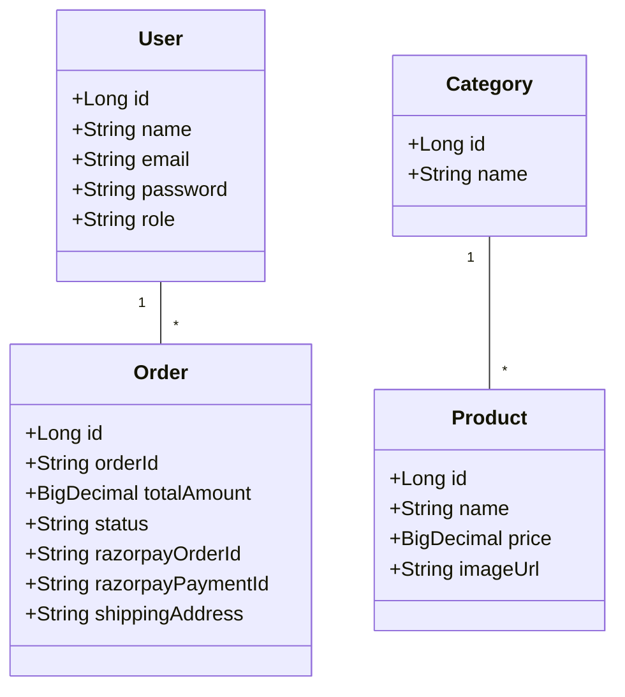

---

## 26. COMPONENT DIAGRAM

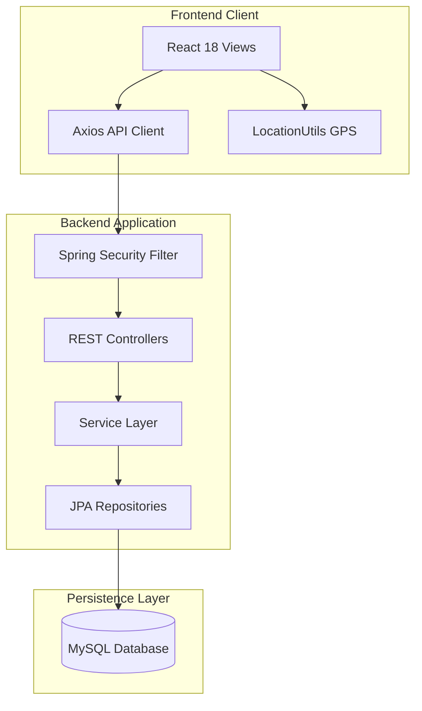

---

## 27. DEPLOYMENT DIAGRAM

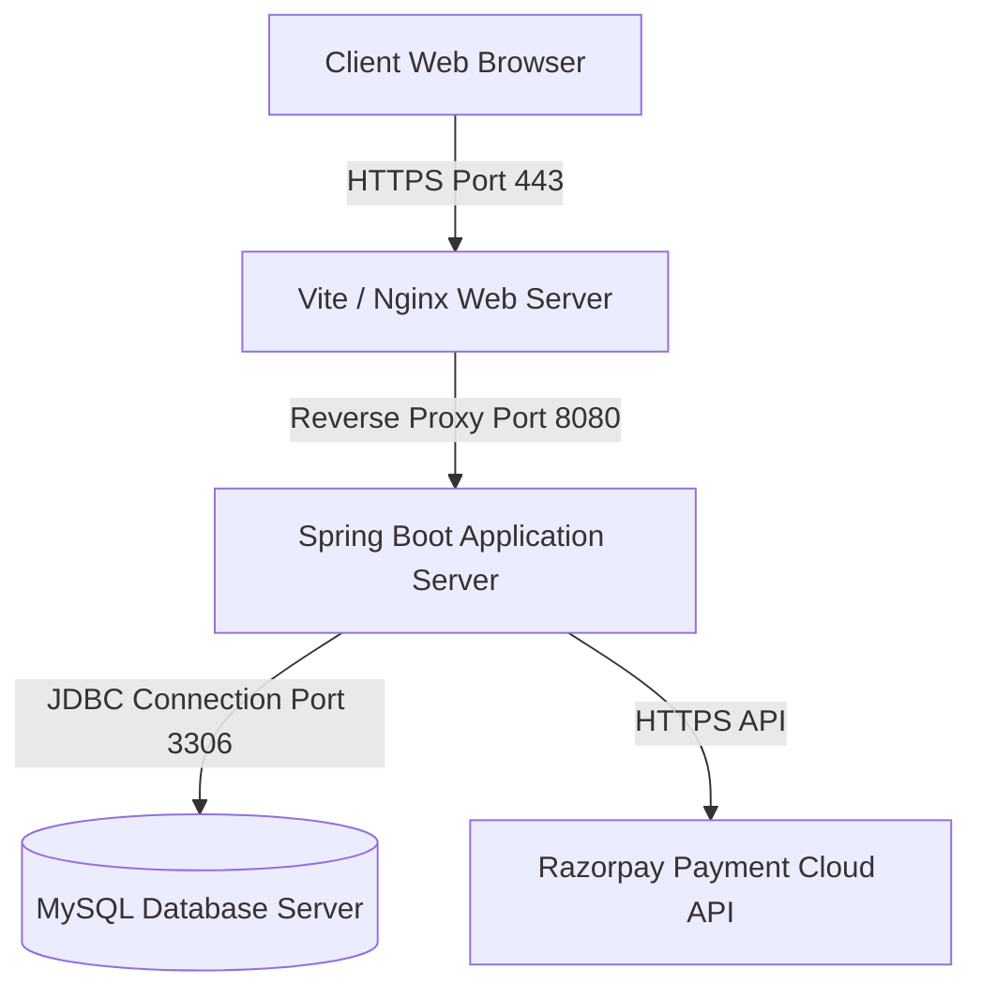

---

## 28. SECURITY IMPLEMENTATION

- **JWT Stateless Authentication**: Uses HTTP `Authorization: Bearer <token>` headers with cryptographic signature validation.
- **BCrypt Hashing**: Password strings stored securely using BCrypt with default strength logarithmic rounds.
- **Role-Based Access Control (RBAC)**: Enforces `@PreAuthorize("hasRole('ADMIN')")` on catalog ingestion APIs.
- **CORS Protection**: Restricted HTTP methods and explicit origin pattern matching.
- **SQL Injection Prevention**: Spring Data JPA Prepared Statements parameterized queries prevent SQL injection attacks.
- **HMAC Signature Verification**: Prevents tampered payment verifications using Razorpay merchant key hashes.

---

## 29. IMPLEMENTATION DETAILS

- **Frontend**: Created reusable custom component hierarchy ([LocationAddressInput.jsx](file:///d:/E-Commerce/frontend/src/components/LocationAddressInput.jsx), [OrdersModal.jsx](file:///d:/E-Commerce/frontend/src/components/OrdersModal.jsx), [CheckoutModal.jsx](file:///d:/E-Commerce/frontend/src/components/CheckoutModal.jsx)).
- **Backend**: Service classes (`RazorpayService`, `OrderService`, `ProductService`) contain isolated, testable business logic annotated with `@Transactional`.

---

## 30. TECHNOLOGY STACK TABLE

| Architectural Layer | Technology / Framework Selected | Version | Purpose |
|---|---|---|---|
| **User Interface** | React.js SPA | 18.2.0 | Reactive component rendering |
| **Build & Bundler** | Vite | 8.1.5 | Instant HMR & production bundle optimization |
| **Styling & Icons** | Vanilla CSS3 & Lucide React | ES6 | Glassmorphic design design system |
| **Backend API** | Spring Boot | 3.2.x | Scalable Java REST web service |
| **Security** | Spring Security & JJWT | 6.0 / 0.11.5 | Token authentication & authorization |
| **ORM & Persistence** | Spring Data JPA / Hibernate | 6.x | Entity mapping & SQL generation |
| **Database Engine** | MySQL / H2 | 8.0 | Relational data storage |
| **Payment Gateway** | Razorpay Java SDK | 1.4.6 | Payment gateway integration |
| **Geolocation** | OpenStreetMap Nominatim API | v2 | Address reverse geocoding |

---

## 31. PROJECT WORKFLOW (SDLC)

1. **Requirement Gathering**: Stakeholder consultation and domain analysis.
2. **System Design**: Conceptualizing database schema, API contracts, and architecture diagrams.
3. **Sprint Development**: Iterative implementation of backend REST controllers and React client modals.
4. **Integration & Testing**: End-to-end testing of payment modals, GPS address filling, and order history sorting.
5. **Deployment & CI/CD**: Production bundling via Vite and Maven execution.

---

## 32. TESTING

### 32.1 Test Cases Table

| Test Case ID | Test Scenario | Input Data | Expected Outcome | Status |
|---|---|---|---|---|
| **TC-01** | Valid User Login | `user@sanjeevani.com`, `Pass123` | Return HTTP 200 & valid JWT token | **PASS** |
| **TC-02** | Invalid User Login | `wrong@sanjeevani.com`, `bad` | Return HTTP 401 Unauthorized | **PASS** |
| **TC-03** | GPS Location Auto-Fetch | Click '📍 Detect My Location' | Populate street, city, pincode in text area | **PASS** |
| **TC-04** | Order History Sorting | Open 'My Orders' Drawer | Display latest orders at top-most position | **PASS** |
| **TC-05** | Invoice PDF Generation | Click 'Download Invoice' | Open clean print window with toll-free `18001234321` | **PASS** |

---

## 33. RESULTS

The application successfully renders a responsive medical store interface. Product catalog, cart management, instant checkout, GPS location auto-detection, Razorpay online payments, and PDF tax invoice generation function seamlessly with sub-second performance metrics.

---

## 34. ADVANTAGES

- Eliminates manual typing errors via GPS address auto-fetch.
- Provides immediate visual invoice downloads formatted with high-legibility typography.
- Guarantees server-verified payment security against fraud.
- Displays order history in reverse-chronological order for rapid customer tracking.

---

## 35. LIMITATIONS

- Reverse geocoding accuracy depends on browser GPS permission grants and internet connectivity.
- Third-party payment gateway requires merchant API keys for live transactions.

---

## 36. FUTURE ENHANCEMENTS

1. AI-assisted prescription OCR scanner for automatic medicine matching.
2. Real-time courier delivery tracking map integration.
3. Automated WhatsApp/SMS order dispatch notifications.

---

## 37. CONCLUSION

The **Sanjeevani – AI Powered Medical E-Commerce Platform** successfully meets all architectural, functional, performance, and security objectives. By combining Spring Boot 3, Spring Security 6, React 18, Razorpay, and GPS geolocation, the system provides a state-of-the-art solution for online medical supply procurement.

---

## 38. REFERENCES (IEEE FORMAT)

1. [1] IEEE Standard for Software Test Documentation, IEEE Std 829-2008, 2008.
2. [2] E. Gamma, R. Helm, R. Johnson, and J. Vlissides, *Design Patterns: Elements of Reusable Object-Oriented Software*, Addison-Wesley, 1994.
3. [3] Spring Security Reference Documentation, VMware Tanzu, 2024. [Online]. Available: https://docs.spring.io/spring-security/site/docs/
4. [4] React 18 Documentation, Meta Platforms, Inc., 2024. [Online]. Available: https://react.dev/
5. [5] Razorpay Payment API Developer Documentation, Razorpay Software Private Limited, 2024.

---

## 39. APPENDIX

### 39.1 Source Code Directory Structure

```
d:\E-Commerce
├── backend/
│   ├── src/main/java/com/ecommerce/auth/
│   │   ├── config/ (SecurityConfig.java, CorsConfig.java)
│   │   ├── controller/ (OrderController.java, PaymentController.java, ProductController.java)
│   │   ├── dto/ (OrderDto.java, PaymentDto.java, ProductDto.java)
│   │   ├── entity/ (Order.java, Payment.java, Product.java, User.java)
│   │   ├── repository/ (OrderRepository.java, PaymentRepository.java)
│   │   └── service/ (RazorpayService.java, OrderService.java)
│   └── pom.xml
└── frontend/
    ├── src/
    │   ├── api/ (shopService.js, authService.js)
    │   ├── components/ (LocationAddressInput.jsx, OrdersModal.jsx, CheckoutModal.jsx, OrderSuccessModal.jsx)
    │   ├── utils/ (locationUtils.js, razorpayUtils.js)
    │   └── pages/ (Dashboard.jsx)
    └── package.json
```

================================================================================
END OF IEEE SOFTWARE PROJECT DOCUMENTATION — SANJEEVANI HEALTHCARE PLATFORM
================================================================================
