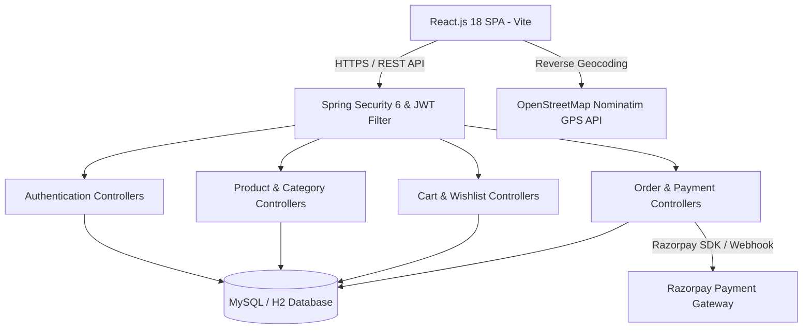

# Sanjeevani Healthcare E-Commerce Platform — Full-Stack Technical Documentation

## Executive Overview
**Sanjeevani Healthcare E-Commerce Platform** is a full-stack medical equipment, healthcare supplies, and pharmaceutical e-commerce solution. It incorporates a **Spring Boot 3 RESTful API backend** secured by **Spring Security 6** and **JWT authentication**, connected to a **React.js 18 (Vite-powered)** frontend with **Razorpay Payment Gateway**, **GPS Location Auto-Detection**, **Order Tracking**, and **PDF Tax Invoice Generation**.

---

## 1. System Architecture



---

## 2. Technology Stack & Key Libraries

### Backend Stack (Java 17 / Spring Boot 3.x)
- **Core Framework**: Spring Boot 3.2.x, Spring MVC, Spring Data JPA
- **Security & Auth**: Spring Security 6, io.jsonwebtoken (jjwt 0.11.5) JWT authentication
- **Database ORM**: Hibernate ORM, MySQL Connector / H2 Database
- **Payment Processing**: Razorpay Java SDK (`com.razorpay:razorpay-java:1.4.6`)
- **Utilities & Build**: Lombok, Maven, Jackson JSON parser

### Frontend Stack (JavaScript / React 18)
- **Core Library**: React 18.2.0, React Router DOM 6
- **Build Tool**: Vite 8.1.5 (Fast HMR & Optimized Minification)
- **Styling**: Vanilla CSS3, Glassmorphism design tokens, CSS Modules, Lucide React Icons
- **Animation**: Framer Motion
- **HTTP Client**: Axios (with Request & Response Interceptors for Auth Tokens)
- **Geolocation**: Browser Geolocation API (`navigator.geolocation`) + OpenStreetMap Nominatim Reverse Geocoding

---

## 3. Core Features & Pin-to-Pin Specifications

### A. Authentication & Session Management
- **User Registration & Login**: Validates credentials against BCrypt-hashed passwords.
- **JWT Stateless Token Auth**: Returns HTTP-only / Authorization Bearer tokens.
- **Session Protection**: Unauthenticated guest 401 interceptors prevent global session wipes when viewing public product catalogs.

### B. Catalog & Search System
- **Categories API**: Direct permitted endpoints `/categories` and `/categories/*`.
- **Products API**: Categorized filtering, full-text search by product title, description, and price ranges.
- **Fallback Category Resolver**: Guarantees zero blank screens by generating category chips dynamically from available product items.

### C. Shopping Cart & Buy Now Flow
- **Cart Management**: Dynamic quantity adjustment, instant total price computation, and persistent user cart states.
- **Buy Now Flow**: Instant single-item purchase modal bypassing shopping cart queues.

### D. GPS Location Auto-Detection & Address Management
- **Browser Geolocation**: Invokes `navigator.geolocation.getCurrentPosition()` to obtain precise coordinates.
- **OpenStreetMap Reverse Geocoding**: Fetches structured address components from `https://nominatim.openstreetmap.org/reverse`.
- **Persistent Storage**: Auto-saves user addresses to `localStorage` (`user_shipping_address`).
- **User Editing**: Real-time editable text area with interactive **`📍 Detect My Location`** button.

### E. Razorpay Payment Gateway Integration
- **Order Initialization**: Backend `RazorpayService` calls `RazorpayClient.orders.create()` generating official Razorpay Order IDs (`order_...`).
- **Signature Verification**: Validates HMAC SHA-256 signatures (`razorpay_order_id + '|' + razorpay_payment_id`) against merchant secret.

### F. Order Management & Tracking
- **Order History Sorting**: Displays orders in reverse chronological order (**Latest / Newest orders FIRST**).
- **Order Detail Breakdown**: Displays 4 clean sections:
  1. Product Details
  2. Customer Data & Delivery Address (Ship To)
  3. Payment Details (Order ID, Payment Method, Razorpay Payment ID, Razorpay Order ID)
  4. Tracking & Delivery Stepper (Ordered ➔ Paid ➔ Packed ➔ Out for Delivery)

### G. Downloadable PDF Tax Invoice
- **Printable HTML Document**: Generates clean, human-readable invoice documents.
- **Invoice Content**: Sanjeevani brand logos, Ship To customer details, itemized table, Payment Details box on left, Order Summary box on right, and toll-free helpline `18001234321`.

---

## 4. Backend Database Schema Design

### Users Entity (`users`)
| Column | Type | Constraints | Description |
|---|---|---|---|
| `id` | BIGINT | PRIMARY KEY, AUTO_INCREMENT | Unique User Identifier |
| `name` | VARCHAR(255) | NOT NULL | User Full Name |
| `email` | VARCHAR(255) | UNIQUE, NOT NULL | User Login Email |
| `password` | VARCHAR(255) | NOT NULL | BCrypt Password Hash |
| `role` | VARCHAR(50) | DEFAULT 'ROLE_USER' | Access Control Role |

### Products Entity (`products`)
| Column | Type | Constraints | Description |
|---|---|---|---|
| `id` | BIGINT | PRIMARY KEY, AUTO_INCREMENT | Product ID |
| `name` | VARCHAR(255) | NOT NULL | Medical Equipment Title |
| `description` | TEXT | | Product Specification |
| `price` | DECIMAL(10,2) | NOT NULL | Selling Price (INR) |
| `category_id` | BIGINT | FOREIGN KEY | Category FK |
| `image_url` | VARCHAR(500) | | Image Path / URL |

### Orders Entity (`orders`)
| Column | Type | Constraints | Description |
|---|---|---|---|
| `id` | BIGINT | PRIMARY KEY, AUTO_INCREMENT | Internal Order ID |
| `order_id` | VARCHAR(100) | UNIQUE, NOT NULL | Display Order Code (`ORD-...`) |
| `user_id` | BIGINT | FOREIGN KEY | Ordering User FK |
| `total_amount` | DECIMAL(10,2) | NOT NULL | Grand Total Amount |
| `status` | VARCHAR(50) | DEFAULT 'PAID' | Order Status (`PAID`, `FAILED`) |
| `payment_method` | VARCHAR(100) | | Payment Gateway / Mode |
| `razorpay_order_id` | VARCHAR(255) | | Razorpay Generated Order ID |
| `razorpay_payment_id` | VARCHAR(255) | | Razorpay Transaction Payment ID |
| `shipping_address` | TEXT | NOT NULL | Customer Delivery Address |
| `created_at` | TIMESTAMP | DEFAULT CURRENT_TIMESTAMP | Order Creation Date/Time |

---

## 5. Security & CORS Configuration Details

### `SecurityConfig.java`
```java
@Configuration
@EnableWebSecurity
public class SecurityConfig {

    @Bean
    public SecurityFilterChain securityFilterChain(HttpSecurity http) throws Exception {
        http
            .cors(cors -> cors.configurationSource(corsConfigurationSource()))
            .csrf(csrf -> csrf.disable())
            .sessionManagement(sm -> sm.sessionCreationPolicy(SessionCreationPolicy.STATELESS))
            .authorizeHttpRequests(auth -> auth
                .requestMatchers(
                    "/api/auth/**",
                    "/categories", "/categories/**",
                    "/products", "/products/**",
                    "/api/categories/**", "/api/products/**"
                ).permitAll()
                .anyRequest().authenticated()
            )
            .addFilterBefore(jwtAuthenticationFilter, UsernamePasswordAuthenticationFilter.class);
            
        return http.build();
    }
}
```

---

## 6. Environment Setup & Deployment

### Backend Setup
```bash
cd backend
mvn clean compile
mvn spring-boot:run
```
- Server context path: `/api`
- Port: `8080` (or configured port)

### Frontend Setup
```bash
cd frontend
npm install
npm run dev
```
- Local URL: `http://localhost:5173/` or `http://127.0.0.1:5173/`
